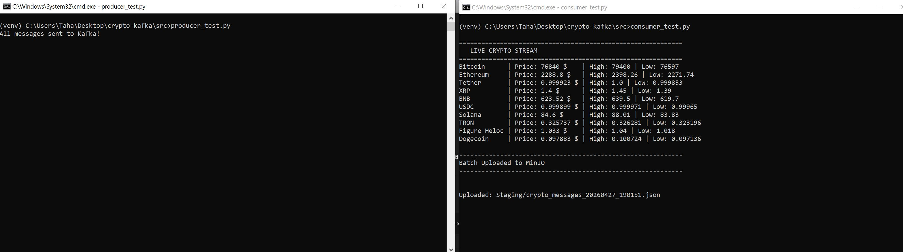

# 🚀 Real-Time Crypto Data Pipeline

This project demonstrates a real-time data engineering pipeline built using Python, Apache Kafka, and MinIO.

It fetches live cryptocurrency data from an API, streams it through Kafka, processes it using a consumer, and stores it in a data lake (MinIO).

---

## 🧠 Project Overview

- Fetches real-time crypto data from CoinGecko API  
- Streams data using Kafka  
- Processes and batches data (every 10 messages)  
- Stores data in MinIO (S3-compatible object storage)  
- Fully containerized using Docker  

---

## 🏗️ Architecture

---

## ⚙️ Docker Environment

Kafka, Zookeeper, and MinIO are all running inside Docker containers.

---

## 📤 Producer (Data Ingestion)

The Python producer fetches live crypto data and sends it to Kafka.

---

## 📥 Consumer (Processing & Batching)

The consumer reads data from Kafka in real-time, formats it, and uploads it in batches to MinIO.

---

## 🗄️ Data Storage (MinIO)

Processed data is stored in MinIO as JSON files for further use.

---

## 🔧 Tech Stack

- Python  
- Apache Kafka  
- MinIO  
- Docker  
