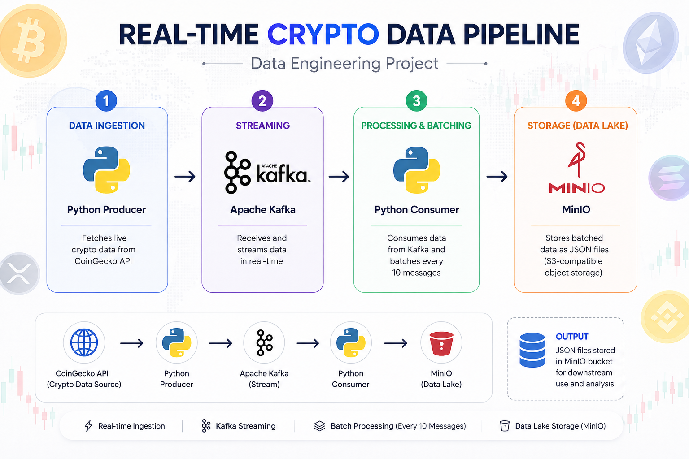
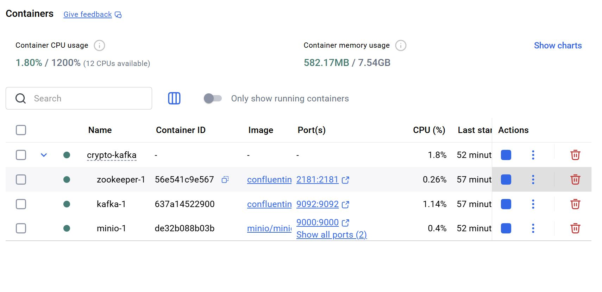
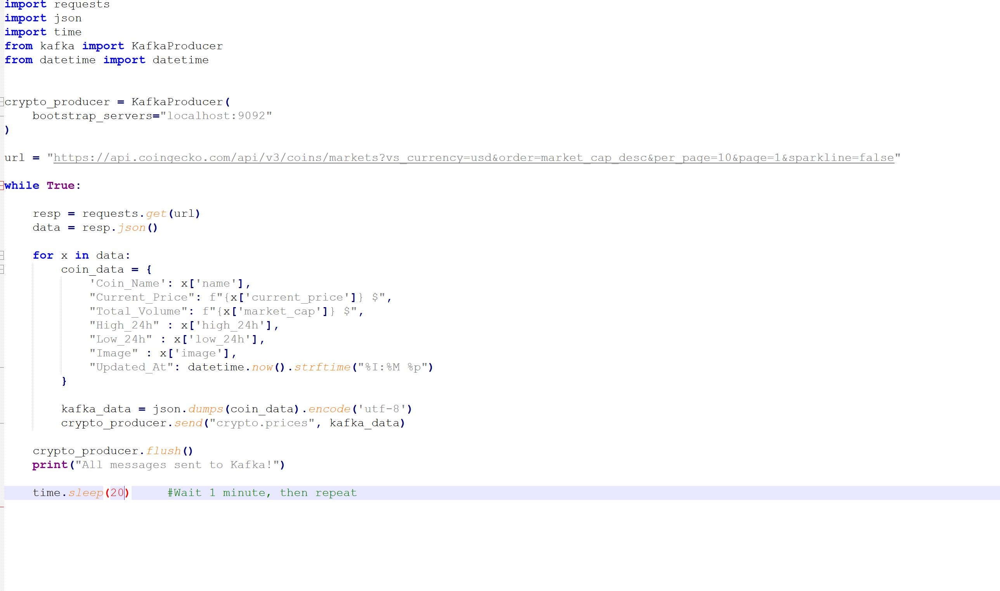
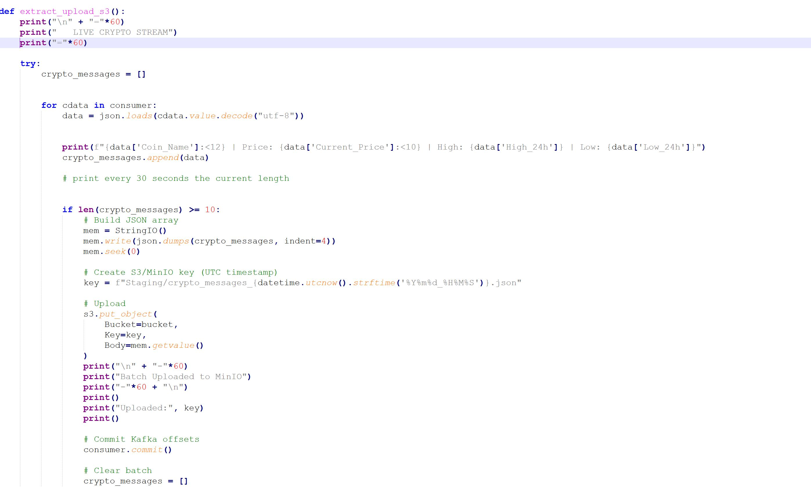
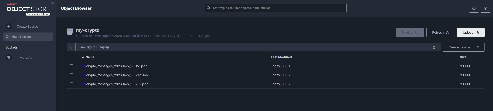

# 🚀 Real-Time Crypto Data Pipeline

This project demonstrates a real-time data engineering pipeline built using Python, Apache Kafka, and MinIO.

It fetches live cryptocurrency data from an API, streams it through Kafka, processes it in real-time, and stores it in a data lake.

---

## 🧠 Project Overview

* Fetches real-time crypto data from CoinGecko API
* Streams data using Apache Kafka
* Processes and batches data (every 10 messages)
* Stores data in MinIO (S3-compatible object storage)
* Fully containerized using Docker

---

## 🏗️ Architecture

---

## ⚙️ Docker Environment

Kafka, Zookeeper, and MinIO are all running inside Docker containers.

---

## 📤 Producer (Data Ingestion)

The Python producer fetches live crypto data from the API and continuously sends it to Kafka.

## 📤 Consumer (Stream Processing)

The Python consumer reads real-time data from Kafka, processes it, batches it, and uploads it to MinIO.

---

## 🔴 Live Producer & Listener (Real-Time Streaming)

This section shows the real-time pipeline in action:

* Producer continuously sends live crypto data to Kafka
* Listener (Consumer) reads messages instantly
* Data is formatted, displayed, and batched
* Every batch is uploaded to MinIO

This demonstrates how real-world streaming pipelines operate.

---

## 🗄️ Data Storage (MinIO)

Processed data is stored in MinIO as JSON files, acting as a data lake for downstream usage.

---

## 🔧 Tech Stack

* Python
* Apache Kafka
* MinIO
* Docker

---

If you have any suggestions or feedback, feel free to connect or reach out 🚀
